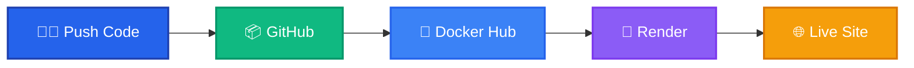

# My - Portfolio Website

Personal portfolio website showcasing my projects, skills, and professional experience as a full-stack developer.

## Overview

This portfolio website is built to present my work, skills, and professional background in a clean, responsive, and interactive format. The website is fully responsive and provides a smooth user experience with animated sections and pinned navigation.

---

## Features

- Responsive design for desktop and mobile
- Pinned navbar and footer for easy navigation
- Smooth scrolling between Home, About, and Projects sections
- Animated reveal on scroll for a polished look
- Project showcase with images, descriptions, tech stack, and GitHub links
- CI/CD pipeline for automated deployment

---

## Project Highlights

### Portfolio Website

**Description:** Personal portfolio website showcasing projects, skills, and experience.  
**Overview:** Built to present work, skills, and professional background in a clean, responsive, and interactive format.

**Highlights:**

- Responsive design for desktop and mobile
- Pinned navbar and footer for easy navigation
- Smooth scroll between Home, About, and Projects sections
- Animated reveals on scroll for polished user experience
- CI/CD pipeline: push to GitHub → Docker Hub → Render deployment

**Role:**

- Designed and implemented full front-end using React
- Structured components for reusability (Navbar, Footer, ProjectCard, TechStack, HeroTextCarousel)
- Integrated project showcase with images, tech stack, and GitHub links
- Implemented smooth scrolling and scroll-margin adjustments for pinned navbar
- Set up automated deployment pipeline from GitHub to Docker Hub to Render

**Tech Used:** React, JavaScript, CSS, React Icons, React Router, Docker, Render

**Live Demo:** [Portfolio Website](https://portfolio-website-latest-75bv.onrender.com/)

---

## Tech Stack

- **Frontend:** React, React Router, CSS, React Icons
- **Deployment & DevOps:** Docker, Render
- **Animations:** Scroll reveal effects for polished UX

---

## Deployment Pipeline

The portfolio website uses a fully automated CI/CD workflow:



**Workflow Steps:**

1. **Developer Push** — Code changes are committed and pushed to GitHub
2. **GitHub Repository** — Source code is versioned and stored
3. **Docker Hub Build** — Automated image build triggered via webhook
4. **Render Deployment** — Platform pulls latest Docker image automatically
5. **Live Website** — Portfolio is deployed and accessible to users

This ensures that any change merged to the main branch is reflected live without manual steps.

---

## Screenshots


---

```

```
